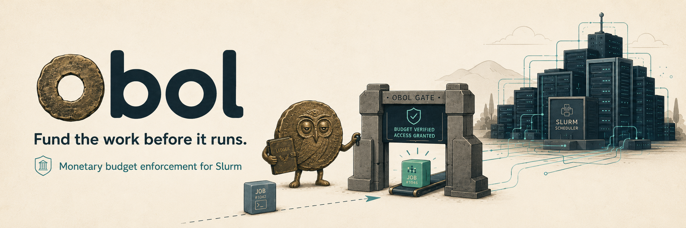

<p align="center">
  
</p>

# obol

[](https://github.com/scttfrdmn/obol/actions/workflows/ci.yml)
[](LICENSE)

Hierarchical, monetary budget enforcement for [Slurm](https://slurm.schedmd.com/).

Named for the [obol](https://en.wikipedia.org/wiki/Obol_(coin)), an ancient small-denomination coin.

Users and groups (Slurm accounts) map to budgets denominated in **money**, independent of
Slurm's service units. The enforcement point is job submission: a job that cannot be funded
does not schedule. Budgets optionally carry a time window with banked-burst mechanics — idle
time banks burst permission; concurrency spends it.

## Status

| Component | State |
|-----------|-------|
| `internal/budget` — the kernel | **built & tested** (conservation + concurrency proven under `-race`, crash-safe WAL durability) |
| `cmd/obold` — the sidecar daemon | **built & tested** — serves GATE/BIND/SETTLE/STATUS over a Unix socket |
| `cmd/obol` — the management CLI | **built & tested** — `show`/`gate`/`bind`/`settle`/`ping` over the socket |
| Lua `job_submit` shim + `site_factor` plugin | designed (`docs/SEAM_DESIGN.md`); validation on burstlab clusters pending |

The architecture — why a sidecar daemon, the three-tier latency model, the `admin_comment`
correlation token, the owned-vs-rented partition policy axis — is documented in
[`docs/SEAM_DESIGN.md`](docs/SEAM_DESIGN.md).

## Try it

```
make build                              # -> bin/obold, bin/obol
bin/obold -socket /tmp/obold.sock -state-dir /tmp/obol -create -balance 5000 -rate 1 &
bin/obol --socket /tmp/obold.sock show
tok=$(bin/obol --socket /tmp/obold.sock gate --account lab --partition cloud --time-limit 1000)
bin/obol --socket /tmp/obold.sock bind   --token "${tok#allow }" --jobid 42
bin/obol --socket /tmp/obold.sock settle --jobid 42 --kind complete --runtime 300
bin/obol --socket /tmp/obold.sock show   # balance debited by the 300s consumed, tail refunded
```

## Build

```
make build     # -> bin/obold
make check     # fmt + vet + lint + race  (what CI enforces)
```

Requires Go 1.26 (single supported toolchain; CI runs 1.26 only).

## Design invariants

The kernel holds these exactly, and they must never regress (see `CLAUDE.md`):

- **Conservation:** `B0 == B + reserved + consumed + write_off`, with integer money.
- **Atomic gate:** check-and-debit as one locked operation — no overdraft race.
- **Deterministic replay:** transitions are pure functions of `(state, command, now)`; the WAL
  logs commands and replays them through the same code paths used live.

## Contributing

GitHub is the source of truth for planning (issues/milestones/labels). PRs only; `main` is
protected. See [`CONTRIBUTING.md`](CONTRIBUTING.md).

## Branding

Project artwork lives in [`docs/assets/`](docs/assets/) — the obol mascot is an
owl-faced ancient coin (the owl for the Athenian obol; the ledger for the books it
keeps) minding the **OBOL GATE** that every job passes through:

| Asset | Use |
|-------|-----|
| `obol-hero.png` | wide banner (the README header above) |
| `obol-logo.png` | square logo + tagline |
| `obol-open-graph.png` | social preview card (see below) |
| `obol-sticker.png` | die-cut sticker, transparent background (swag) |

`obol-open-graph.png` is the GitHub **social preview** (the card shown when the
repo is linked on GitHub/Slack/X). GitHub can't pick it up from the repo tree — it
must be uploaded once as a repo setting: **Settings → General → Social preview →
Edit → Upload an image**, then choose `docs/assets/obol-open-graph.png`.

## License

Apache-2.0. See [`LICENSE`](LICENSE).
