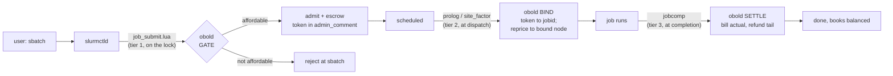
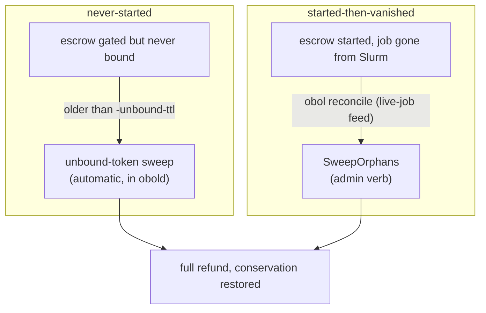

# Production readiness

An honest map of what's validated, on what, and how far along the road to
unattended production Obol is. Pairs with the compatibility policy in the
[README](../README.md#maturity--compatibility) and the running instructions in
[operations.md](operations.md).

> **Short version:** the money kernel, daemon, protocol, and CLI are built and
> tested (unit + `-race`), and the Slurm seam is validated end to end in a
> container across all three target Slurm generations. It is **pre-1.0** — minor
> versions may break the wire/state format — and not yet recommended for
> unattended production without an operator familiar with [operations.md](operations.md).

---

## The paths a job takes

Obol touches a job at three points in its Slurm lifecycle, plus two background
janitors that reconcile anything that slips through.

The daemon runs beside slurmctld and answers each call over a local Unix socket.
Only the gate (tier 1) is on the controller lock; it is a memory op + loopback
round-trip, never a disk wait (durability lands off-lock via group commit). See
[SEAM_DESIGN.md](SEAM_DESIGN.md) §3 for the latency model.

### When something is lost

If a lifecycle event never fires (lost completion, a crash between phases), an
escrow could stick. Two janitors reclaim them, partitioned by whether the job
ever started, so they never race:

Details and cadence in [operations.md](operations.md#orphan-reconciliation-the-two-janitors).

---

## Compatibility matrix

| Dimension | Supported | Notes |
|-----------|-----------|-------|
| **Slurm** | 22.05, 23.11, 24.05 | the three burstlab generations; the seam is validated on each ([below](#validation-status)) |
| **OS (validated)** | Rocky 8 / 9 / 10 | one per Slurm generation, in the multi-generation Docker tier |
| **Go toolchain** | 1.26 | single supported toolchain; CI builds only 1.26 |
| **Arch (release binaries)** | linux amd64, arm64 | built by GoReleaser |
| **Slurm plugin surface** | `JobSubmitPlugins=lua` + prolog/jobcomp scripts | the `site_factor` burst-dispatch plugin ships as reference C source, not yet CI-built |
| **Wire protocol** | versioned; obol & obold must match | a mismatched shim/daemon fail loudly rather than misparse |
| **On-disk state** | may change across **minor** versions (pre-1.0) | back up and roll state with the binary ([operations.md](operations.md#upgrades--rollback)) |

**Compatibility policy (pre-1.0):** `0.y` minor bumps may break the wire protocol
and on-disk state format; `0.y.z` patches are fixes. Keep the daemon and the
seam's `obol`/shim on the same release across a minor bump.

---

## Validation status

What is continuously tested in CI vs. validated locally/manually. **CI runs the
unit tier only** — the integration tiers are build-tag-gated and run on demand
(they need Docker or a live cluster), so they are *validated*, not *continuously
gating*.

| Tier | Command | Runs in CI? | Proves |
|------|---------|-------------|--------|
| **Unit + race** | `make check` (`go test -race`, vet, lint, coverage) | ✅ every PR | kernel conservation & concurrency, wire framing, daemon/CLI over a socket, Lua↔Go framing, the money-path logic |
| **Docker Slurm (packaged)** | `make integ-docker` | ⬜ local (Docker) | the real GATE→SETTLE seam against an actual slurmctld (EPEL 22.05), incl. arrays & multi-source |
| **Docker multi-generation** | `make integ-docker-multigen` | ⬜ local (Docker, slow) | the seam on Slurm 22.05 / 23.11 / 24.05 **built from source**, per generation, incl. the `admin_comment` ABI |
| **AWS ParallelCluster** | `make integ-pcluster` | ⬜ manual (needs a cluster + creds) | the seam on real multi-node cloud Slurm with cloud partition policy |

Each tier's exact assertions are in [INTEGRATION.md](INTEGRATION.md). Surfacing the
Docker tiers in CI (with layer caching for the source builds) is a possible future
step; today they're an operator/maintainer validation gate, run before releases.

---

## Production-readiness checklist

Before running Obol where it gates real spend:

**Deployment**
- [ ] `obold` on the controller host, started `Before=slurmctld`, restarts cleanly (systemd unit in [installation.md](installation.md#4-run-it-as-a-service)).
- [ ] `-state-dir` on durable storage (not tmpfs); `-sync true` (the default).
- [ ] Socket path locked down, or an `admin_users`/`admin_groups` list set (shared controller).

**Config**
- [ ] Accounts, rates, and windows reflect real allocations; pricing (`node_types`/TRES) matches the hardware.
- [ ] `obol resolve`/`obol simulate` sanity-checked against a few representative submissions.

**Seam**
- [ ] Shim + prolog + jobcomp installed and pointed at the socket; a test `sbatch` gates and settles (verify per [installation.md](installation.md#6-verify)).
- [ ] Per-partition `fail_closed` set correctly (cloud → closed, on-prem → open).
- [ ] The seam's `obol` and the daemon are the **same release**.

**Operations**
- [ ] State-dir backed up on a schedule; restore tested.
- [ ] A periodic `squeue -h -o '%A' | obol reconcile` timer, alongside the automatic unbound sweep.
- [ ] Monitoring on `obol ping`, the conservation check in `obol show`, and low/lapsed balances.
- [ ] Upgrade + rollback playbook understood (back up state, bump daemon + seam together).

**Awareness**
- [ ] Operator has read [operations.md](operations.md) — especially recovery and fail-mode behavior.
- [ ] Team understands this is pre-1.0: minor versions may change wire/state formats.

---

## Known limitations & future work

- **WAL grows unbounded** — never truncated (it's the audit trail), no periodic
  re-snapshot, so recovery replays from offset 0. Fast at normal scale;
  log-compaction is a future optimization, not a correctness issue.
- **`site_factor` plugin is reference source** — the burst-dispatch *decision* is
  daemon-side and tested (`obol dispatch`/`handleDispatch`), but the C plugin that
  calls it from `priority/multifactor` isn't CI-built.
- **Integration tiers aren't in CI** — validated on demand ([above](#validation-status)).
